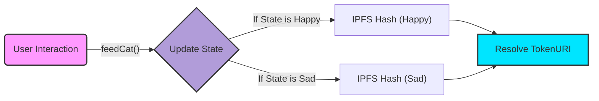
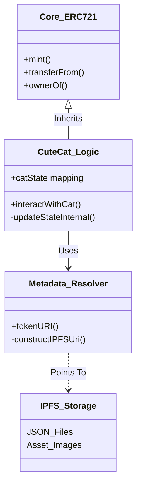

<div align="center">
  <br/>
  <a href="https://git.io/typing-svg">
    
  </a>

  <br/>

  <p>
    
    
    
  </p>

  <p width="90%">
    <b>A state-of-the-art decentralized application bridging on-chain logic with flexible storage.</b>
  </p>

  <br/>

  <p>
    <a href="#-protocol-manifesto"><strong>📜 Manifesto</strong></a> &nbsp;|&nbsp;
    <a href="#-dynamic-state-engine"><strong>🧠 Dynamic Engine</strong></a> &nbsp;|&nbsp;
    <a href="#-system-architecture"><strong>🏗 Architecture</strong></a> &nbsp;|&nbsp;
    <a href="#-tech-matrix"><strong>💻 Tech Stack</strong></a>
  </p>

</div>

---

## 📜 Protocol Manifesto

**CuteCatNFT** is a technical reference implementation for **senior-grade NFT systems**.

Most NFTs are static pointers to centralized servers. This protocol implements a **Dynamic State Machine** directly on the Ethereum blockchain. The visual representation (metadata on IPFS) changes autonomously based on user interactions.

This project proves that decentralized assets can be **interactive, evolving, and immutable** simultaneously.

---

## 🧠 Dynamic State Engine

This is the core innovation. The NFT's appearance is not fixed; it evolves based on on-chain state.

### The "Evolution" Loop



> **Technical Implication:** This architecture allows for assets that "level up" or change appearance without centralized databases.

---

## 🏗 System Architecture

The codebase follows a strict **Separation of Concerns** pattern.

### 📐 Protocol Stack



---

## 🛡 Testing & Reliability

In professional Web3 engineering, reliability is paramount. This project utilizes **Foundry** for deterministic testing.

| Test Layer | Focus Area | Methodology |
| --- | --- | --- |
| **Unit Tests** | Core Functions | Isolated testing of `mint`, `approve`, and state updates. |
| **State Transition** | Dynamic Logic | Verifying that on-chain actions *guarantee* metadata URI changes. |
| **Edge Cases** | Security | Testing zero-address inputs and unauthorized state changes. |
| **Integration** | IPFS format | Ensuring constructed URIs conform to IPFS standards. |

---

## 💻 Tech Matrix & Use Cases

<table width="100%">
<tr>
<td width="50%" valign="top">
<h3>🧰 The Stack</h3>
<ul>
<li><b>Engine:</b> Solidity <code>^0.8.20</code></li>
<li><b>Framework:</b> Foundry (Forge & Cast)</li>
<li><b>Standards:</b> ERC-721 (OpenZeppelin)</li>
<li><b>Storage:</b> IPFS (InterPlanetary File System)</li>
</ul>
</td>
<td width="50%" valign="top">
<h3>🚀 Applications</h3>
<ul>
<li><b>GameFi Assets</b> (XP-based visuals)</li>
<li><b>Reputation Identities</b> (DAO status)</li>
<li><b>DeFi Receipts</b> (Visuals based on APY)</li>
</ul>
</td>
</tr>
</table>

<div align="center">


<code>Protocol Engineered by NexTechArchitect</code>


<a href="https://github.com/NexTechArchitect">

</a>
&nbsp;&nbsp;
<a href="https://linkedin.com/in/amit-kumar-811a11277">

</a>
&nbsp;&nbsp;
<a href="https://x.com/itZ_AmiT0">

</a>

</div>

```

```
