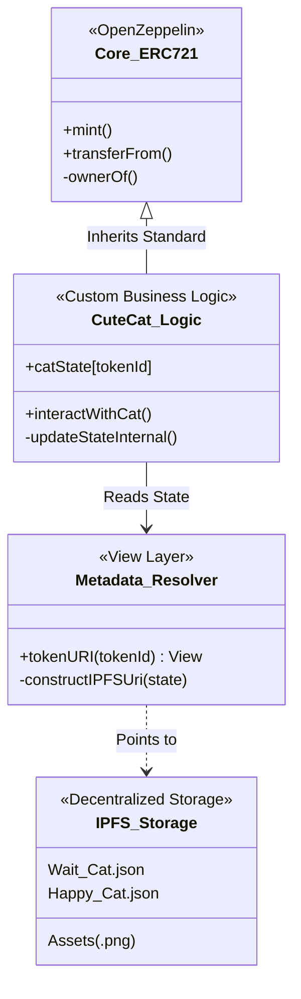

<div align="center">
  <br/>
  <a href="https://git.io/typing-svg">
    
  </a>

  <br/>

  <p>
    
    
    
    
  </p>

  <p width="90%">
    <b>A state-of-the-art decentralized application bridging rigorous on-chain logic with flexible off-chain storage.</b><br/>
    Designed to demonstrate how evolving, state-dependent assets are architected for the modern Web3 ecosystem.
  </p>

  <br/>
  <br/>

  <code>
  [ <a href="#-protocol-manifesto">📜 Manifesto</a> ] ---
  [ <a href="#-dynamic-state-engine">🧠 Dynamic Engine</a> ] ---
  [ <a href="#-system-architecture">🏗 Architecture</a> ] ---
  [ <a href="#-testing--reliability">🛡 Reliability</a> ] ---
  [ <a href="#-tech-matrix">💻 Tech Stack</a> ]
  </code>

  <br/>
  <br/>
</div>

---

## 📜 Protocol Manifesto

**CuteCatNFT** is not a trivial profile picture project. It is a technical reference implementation for **senior-grade NFT systems**.

Most NFTs are static pointers to centralized servers. This protocol is different. It implements a **Dynamic State Machine** directly on the Ethereum blockchain. The visual representation of the NFT (the metadata stored on IPFS) changes autonomously based on on-chain interactions and logic.

This project exists to prove that decentralized assets can be **interactive, evolving, and immutable** simultaneously, without relying on centralized backends to update metadata.

---

## 🧠 Dynamic State Engine

This is the core innovation of the protocol. The NFT's appearance is not fixed; it is a function of its current state on the blockchain.

### The "Evolution" Loop

Instead of hardcoding a single `tokenURI`, the smart contract calculates the URI dynamically whenever it is requested.

```mermaid
graph LR
    Interaction(User Interaction) -->|e.g., feedCat()| OnChainState{Update On-Chain State}
    
    subgraph "Smart Contract Logic"
    OnChainState -- State = HAPPY --> URI_A[Select IPFS Hash A]
    OnChainState -- State = SAD --> URI_B[Select IPFS Hash B]
    end
    
    URI_A --> FinalURI(Resolve tokenURI)
    URI_B --> FinalURI
    
    style Interaction fill:#f9f,stroke:#333,stroke-width:2px,color:#000
    style OnChainState fill:#b19cd9,stroke:#333,stroke-width:2px,color:#000
    style FinalURI fill:#00e5ff,stroke:#333,stroke-width:2px,color:#000

```

> **Technical Implication:** This allows for assets that level up in games, change based on DeFi holdings, or reflect governance participation, all entirely on-chain.

---

## 🏗 System Architecture

The codebase follows a strict **Separation of Concerns** pattern to ensure maintainability and upgradeability. The token standard, metadata logic, and storage layers are decoupled.

### 📐 Protocol Stack Diagram



---

## 🛡 Testing & Reliability

In professional Web3 engineering, "it works on my machine" is not enough. This project utilizes **Foundry** for a rigorous, deterministic testing environment.

### Test Coverage Strategy

| Test Layer | Focus Area | Methodology |
| --- | --- | --- |
| **Unit Tests** | Core Functions | Isolated testing of `mint`, `approve`, and state updates to ensure atomic correctness. |
| **State Transition** | Dynamic Logic | Verifying that specific on-chain actions *guarantee* the correct metadata URI change. |
| **Edge Cases** | Security Boundaries | Testing zero-address inputs, unauthorized state changes, and overflow protection. |
| **Integration** | IPFS format | Ensuring the constructed URIs conform strictly to IPFS addressing standards. |

---

## 💻 Tech Matrix & Use Cases

Designed for scalability and future integration.

<table width="100%">
<tr>
<td width="50%" valign="top">
<h3>🧰 The Stack</h3>
<ul>
<li><b>Engine:</b> Solidity <code>^0.8.20</code></li>
<li><b>Framework:</b> Foundry (Forge & Cast)</li>
<li><b>Standards:</b> ERC-721 (via OpenZeppelin v5)</li>
<li><b>Storage Layer:</b> IPFS (InterPlanetary File System)</li>
</ul>
</td>
<td width="50%" valign="top">
<h3>🚀 Potential Applications</h3>
<ul>
<li><b>Evolving GameFi Assets</b> (XP-based visuals)</li>
<li><b>Reputation Identities</b> (DAO activity status)</li>
<li><b>DeFi Vault Receipts</b> (Visuals change based on APY)</li>
</ul>
</td>
</tr>
</table>

<div align="center">


<code>Protocol Engineered by NexTechArchitect</code>


<i>Solidity Specialist • Foundry Expert • Web3 Architect</i>


<a href="https://github.com/NexTechArchitect">

</a>
&nbsp;&nbsp;
<a href="https://linkedin.com/in/amit-kumar-811a11277">

</a>
&nbsp;&nbsp;
<a href="https://x.com/itZ_AmiT0">

</a>

</div>

```

```
