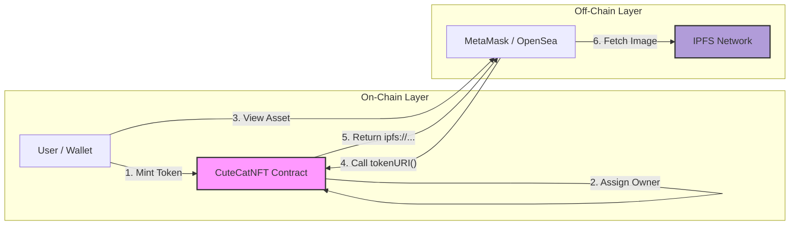

  

   

  

    
  

  

    <b>A production-grade NFT system demonstrating clean separation of concerns.</b> 
    Bridging on-chain ownership with off-chain IPFS metadata to ensure your assets are permanent and viewable in MetaMask.
  

   

  <table>
    <tr>
      <td align="center"><a href="#-project-overview"><strong>📌 Overview</strong></a></td>
      <td align="center"><a href="#-ipfs-architecture"><strong>🏗 Architecture</strong></a></td>
      <td align="center"><a href="#-script-capabilities"><strong>⚙️ Scripts</strong></a></td>
      <td align="center"><a href="#-tech-stack"><strong>💻 Tech Stack</strong></a></td>
    </tr>
  </table>

---

## 📌 Project Overview

**CuteCatNFT** is not a basic tutorial project. It is a robust **ERC-721 implementation** designed for protocol-level environments.

Unlike simple tokens, this project demonstrates the full lifecycle of a digital asset:

* **🔒 Secure Minting:** Assets are created using rigorous checks via `MintCuteCatNft.s.sol`.
* **🌍 Decentralized Storage:** Metadata is not on a server; it's on **IPFS**, ensuring it can never be deleted.
* **🦊 Wallet Optimized:** Token URIs are formatted specifically to render perfectly in **MetaMask** and **OpenSea**.
* **🛡️ Admin Controls:** Governance features to flip minting states (`FlipMintActive`) and withdraw funds securely.

---

## 🏗 IPFS Architecture

The core value of this project is how it handles data. We utilize a **Split-Stack Architecture**.

### 🧬 Data Resolution Flow

> **Why this matters:** The "Cute Cat" image is immutable. It relies on cryptographic hashes, not website URLs.

---

## ⚙️ Script Capabilities

This repository includes a suite of professional Foundry scripts located in the `script/` folder. These automations replace manual console interactions.

| 📜 Script File | 🛠 Functionality | 🔑 Impact |
| --- | --- | --- |
| **`DeployCuteCatNft.s.sol`** | Deployment | Deploys logic & configures IPFS Base URI. |
| **`MintCuteCatNft.s.sol`** | Interaction | Mints a new NFT to a specific target address. |
| **`FlipMintActive...s.sol`** | Governance | Toggles contract state (`OPEN` / `CLOSED`). |
| **`CheckTotalMinted...s.sol`** | Verification | Audits the current total supply on-chain. |
| **`Withdraw...Funds.s.sol`** | Security | Securely drains ETH to the owner wallet. |

---

## 💻 Tech Stack

The project is built using the modern **Ethereum Development Stack**.

* **Language:** Solidity `^0.8.20`
* **Framework:** Foundry (Forge, Cast, Anvil)
* **Standard:** ERC-721 (OpenZeppelin)
* **Storage:** IPFS (Pinata / NFT.Storage)

   
  
   
  <b>Developed by NexTechArchitect</b>
   
  <i>Building the Future of Web3</i>
    

  
  

