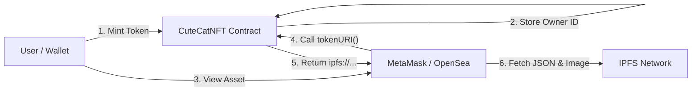

<div align="center">
  <br/>
  <a href="https://git.io/typing-svg">
    
  </a>

  <br/>

  <p>
    
    
    
    
  </p>

  <p width="90%">
    <b>A production-grade NFT system demonstrating clean separation of concerns.</b><br/>
    Bridging on-chain ownership with off-chain IPFS metadata to ensure your assets are viewable in MetaMask and marketplaces.
  </p>

  <br/>

  <p>
    <a href="#-project-overview"><strong>📌 Overview</strong></a> &nbsp;|&nbsp;
    <a href="#-ipfs-architecture"><strong>🏗 Architecture</strong></a> &nbsp;|&nbsp;
    <a href="#-script-capabilities"><strong>⚙️ Scripts</strong></a> &nbsp;|&nbsp;
    <a href="#-tech-stack"><strong>💻 Tech Stack</strong></a>
  </p>

</div>

---

## 📌 Project Overview

**CuteCatNFT** is not a basic tutorial project. It is a robust **ERC-721 implementation** designed for protocol-level environments.

Unlike simple tokens, this project demonstrates the full lifecycle of a digital asset:
1.  **Minting:** Secure creation of assets using `MintCuteCatNft.s.sol`.
2.  **Storage:** Decentralized metadata handling via IPFS (InterPlanetary File System).
3.  **Visibility:** Optimized Token URIs ensuring the "Cat" image renders perfectly in wallets like **MetaMask**.
4.  **Management:** Admin controls to flip minting states (`FlipMintActive`) and withdraw funds.

---

## 🏗 IPFS Architecture

The core value of this project is how it handles data. We do not store images on centralized servers.

### 🧬 Data Resolution Flow



> **Result:** The "Cute Cat" image is immutable. It cannot be changed or deleted by a centralized server, ensuring true ownership.

---

## ⚙️ Script Capabilities

This repository includes a suite of professional Foundry scripts to manage the contract lifecycle, located in `script/`.

| Script Name | Functionality |
| --- | --- |
| **`DeployCuteCatNft.s.sol`** | Deploys the contract and sets the initial IPFS Base URI. |
| **`MintCuteCatNft.s.sol`** | Mints a new NFT to a specific target address. |
| **`FlipMintActiveCuteCatNft.s.sol`** | **Governance:** Toggles the contract state between `OPEN` and `CLOSED`. |
| **`CheckTotalMinted...s.sol`** | Verifies the current total supply and mint status. |
| **`WithdrawCuteCatFunds.s.sol`** | **Security:** Withdraws accumulated ETH to the owner's wallet. |

---

## ✨ Key Features

<table width="100%">
<tr>
<td width="50%" valign="top">
<h3>🔹 On-Chain Logic</h3>
<ul>
<li><b>OpenZeppelin Standard:</b> Built on battle-tested ERC721 libraries.</li>
<li><b>Access Control:</b> Strict ownership checks for admin functions.</li>
<li><b>Gas Efficiency:</b> Optimized storage packing for lower fees.</li>
</ul>
</td>
<td width="50%" valign="top">
<h3>🔹 Off-Chain Data</h3>
<ul>
<li><b>IPFS Storage:</b> Metadata is distributed, not centralized.</li>
<li><b>Dynamic URI:</b> The contract generates the correct pointer logic.</li>
<li><b>Wallet Ready:</b> JSON schemas formatted specifically for MetaMask/OpenSea.</li>
</ul>
</td>
</tr>
</table>

---

## 🧪 Testing & Reliability

The project maintains high reliability through a comprehensive **Foundry Test Suite** (`CuteCatNFTTest.t.sol`).

* ✅ **Mint Validation:** Ensures users cannot mint beyond supply caps.
* ✅ **URI Correctness:** Verifies that `tokenURI(id)` returns the exact IPFS string.
* ✅ **Transfer Security:** Tests that only owners can move their Cats.
* ✅ **Withdrawal Logic:** Ensures only the Admin can access contract funds.

---

## 🚀 Use Cases

* **Gaming Assets:** Playable characters stored permanently.
* **Profile Pictures (PFP):** Decentralized identity avatars.
* **Membership:** NFT-gated access using ownership verification.

---

<div align="center">


<code>Protocol Engineered by NexTechArchitect</code>


<a href="https://github.com/NexTechArchitect">

</a>
&nbsp;&nbsp;
<a href="https://linkedin.com/in/amit-kumar-811a11277">

</a>
&nbsp;&nbsp;
<a href="https://x.com/itZ_AmiT0">

</a>

</div>

```

```

