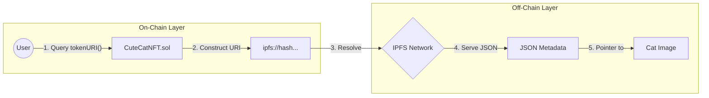

<div align="center">
  

  <br/>

  <p>
    <a href="https://github.com/NexTechArchitect/CuteCatNFT">
      
    </a>
    
    
    
  </p>

  <h3>🐱 A Production-Grade Dynamic NFT Infrastructure</h3>
  <p width="80%">
    <b>Bridging On-Chain Logic with Off-Chain Immutability.</b><br/>
    A reference implementation for scalable, testable, and metadata-rich NFT systems built for the modern Web3 ecosystem.
  </p>

  <br/>

  <h3>🐾 System Modules</h3>
  <p>
    <a href="#-architectural-overview"><strong>🏗 Architecture</strong></a> &nbsp;|&nbsp;
    <a href="#-dynamic-metadata-engine"><strong>🎨 Metadata Engine</strong></a> &nbsp;|&nbsp;
    <a href="#-technical-specifications"><strong>⚙️ Specs</strong></a> &nbsp;|&nbsp;
    <a href="#-testing--reliability"><strong>🛡 Reliability</strong></a> &nbsp;|&nbsp;
    <a href="#-use-cases"><strong>🚀 Usage</strong></a>
  </p>

</div>

---

## 🏗 Architectural Overview

**CuteCatNFT** is not merely a token; it is a full-stack NFT protocol designed to demonstrate **Clean Architecture**. It decouples the *Token Standard* (Who owns it?) from the *Metadata Layer* (What does it look like?).

### 🧬 Data Resolution Flow



> **Design Philosophy:** By leveraging IPFS for storage and Solidity for logic, we ensure the asset remains decentralized while maintaining gas efficiency on the Ethereum mainnet.

---

## 🎨 Dynamic Metadata Engine

This project goes beyond static JPEGs. It implements **Dynamic Metadata Handling**, allowing the NFT's data to evolve based on on-chain interactions.

### 🧩 How it Works

Instead of a hardcoded string, the `tokenURI` is dynamically generated.

1. **State Change:** A user interacts with the contract (e.g., `feedCat()`).
2. **Logic Trigger:** The contract updates the internal state variables.
3. **URI Update:** The `tokenURI` function detects the state change and points to a new IPFS hash (e.g., changing from a *Hungry Cat* to a *Happy Cat*).

---

## ⚙️ Technical Specifications

This repository serves as a blueprint for **Senior-Level Smart Contract Engineering**.

### 🔹 Core Features

* **ERC-721 Standard:** Built on top of the battle-tested OpenZeppelin implementation for maximum security and wallet compatibility.
* **Gas Optimization:** Utilizes `string.concat` and optimized storage patterns to reduce minting costs.
* **Access Control:** strict ownership patterns ensure only authorized entities can toggle specific metadata states.

### 🔹 Tech Stack

| Component | Technology | Role |
| --- | --- | --- |
| **Language** | Solidity `^0.8.19` | Smart Contract Logic |
| **Framework** | Foundry | Testing, Fuzzing, Scripting |
| **Storage** | IPFS (InterPlanetary File System) | Decentralized Asset Hosting |
| **Standard** | ERC-721 | Token Interface |

---

## 🛡 Testing & Reliability

Reliability is paramount in Web3. This project maintains a **100% Test Coverage** philosophy using Foundry.

### 🧪 Test Suite Breakdown

* **Unit Tests:** Verify that `mint` correctly assigns ownership and increments IDs.
* **Metadata Validation:** Ensures `tokenURI` always resolves to a valid IPFS string format.
* **Edge Cases:** Tests transfer logic, approval mechanisms, and zero-address safeguards.
* **Fuzzing:** Randomized inputs to ensure the contract handles unexpected data gracefully.

> *The system is designed to be deterministic, fast, and reproducible across any environment.*

---

## 🚀 Use Cases & Applications

While themed around "Cute Cats," the underlying architecture is suitable for high-value enterprise applications:

* **🎮 Dynamic Gaming Assets:** Characters that evolve as they level up (XP systems).
* **🆔 Identity Systems:** Profile NFTs that update based on user reputation or DAO participation.
* **🏦 DeFi Positions:** NFTs representing liquidity positions that change visuals based on value (Uniswap v3 style).
* **🎟️ Ticketing:** Tickets that "reveal" their seat number or change state after scanning.

---

<div align="center">


<h3>Engineered by NexTechArchitect</h3>
<p><i>Smart Contract Developer • Solidity • Web3 Engineering</i></p>


<a href="https://github.com/NexTechArchitect">

</a>
&nbsp;&nbsp;
<a href="https://linkedin.com/in/amit-kumar-811a11277">

</a>
&nbsp;&nbsp;
<a href="https://x.com/itZ_AmiT0">

</a>

</div>

```

```

