<div align="center">

  <br />
  <br />

  

  <h1 style="font-size: 3rem; margin-bottom: 0;">CuteCat NFT Protocol</h1>

  <p style="font-size: 1.1rem; color: #b298dc; max-width: 600px;">
    <strong>A production-grade ERC-721 implementation demonstrating decentralized asset provenance.</strong><br/>
    Bridging on-chain ownership with immutable IPFS metadata for permanent digital assets.
  </p>

  <p>
    <a href="https://github.com/NexTechArchitect/FOUNDRY-Basic-and-Mood-Nft">
      
    </a>
    &nbsp;
    <a href="https://github.com/NexTechArchitect/FOUNDRY-Basic-and-Mood-Nft">
      
    </a>
    &nbsp;
    <a href="https://ipfs.tech/">
      
    </a>
  </p>

  <br />

</div>

---

## 📑 Protocol Navigation

<div align="center">
<table>
  <tr>
    <td align="center" width="180px">
      <a href="#-executive-summary">
        <br />
        <b>Executive Summary</b>
      </a>
    </td>
    <td align="center" width="180px">
      <a href="#%EF%B8%8F-ipfs-architecture">
        <br />
        <b>System Architecture</b>
      </a>
    </td>
    <td align="center" width="180px">
      <a href="#%EF%B8%8F-script-automation">
        <br />
        <b>Script Automation</b>
      </a>
    </td>
    <td align="center" width="180px">
      <a href="#-tech-stack">
        <br />
        <b>Tech Stack</b>
      </a>
    </td>
  </tr>
</table>
</div>

---

## 🧠 Executive Summary

**CuteCatNFT** is a robust **ERC-721 implementation** designed for protocol-level environments. It moves beyond basic tutorials to demonstrate the full lifecycle of a secure digital asset.

Unlike simple tokens, this project enforces strict provenance:
* **🔒 Secure Minting:** Assets are created using rigorous checks via Foundry scripts.
* **🌍 Decentralized Storage:** Metadata is anchored on **IPFS**, ensuring the asset layer is immutable and censorship-resistant.
* **🦊 Wallet Optimized:** Token URIs are formatted specifically for seamless rendering in **MetaMask** and **OpenSea**.
* **🛡️ Governance Controls:** Includes administrative functions to toggle minting states (`FlipMintActive`) and manage protocol funds securely.

---

## 🏗️ IPFS Architecture

The core value of this project is its **Split-Stack Architecture**, separating the Ownership Layer (On-Chain) from the Asset Layer (Off-Chain).

```mermaid
graph LR
    User["👤 User / Wallet"]
    Contract["🛡️ NFT Contract"]
    IPFS["🌍 IPFS Network"]
    Display["🖼️ MetaMask / OpenSea"]

    subgraph "On-Chain Layer"
      User -- "1. Mint Token" --> Contract
      Contract -- "2. Assign Owner" --> Contract
    end

    subgraph "Off-Chain Layer"
      User -- "3. View Asset" --> Display
      Display -- "4. Call tokenURI()" --> Contract
      Contract -- "5. Return ipfs://..." --> Display
      Display -- "6. Fetch Image" --> IPFS
    end

    style Contract fill:#2d1b4e,stroke:#9d4edd,stroke-width:2px
    style IPFS fill:#1a1a1a,stroke:#b298dc
    style User fill:#1a1a1a,stroke:#fff
    style Display fill:#1a1a1a,stroke:#fff

```



> **Engineering Note:** The visual asset relies on cryptographic hashes (CID), not centralized URLs. This ensures that even if the website goes down, the NFT remains viewable.

---

## ⚙️ Script Automation

This repository includes a suite of professional Foundry scripts located in the `script/` folder. These automations replace error-prone manual console interactions.

| 📜 Script File | 🛠 Functionality | 🔑 Protocol Impact |
| --- | --- | --- |
| **`DeployCuteCatNft.s.sol`** | **Deployment** | Deploys logic & configures the initial IPFS Base URI. |
| **`MintCuteCatNft.s.sol`** | **Interaction** | Mints a new NFT to a specific target address securely. |
| **`FlipMintActive.s.sol`** | **Governance** | Toggles the contract state (`OPEN` / `CLOSED`) to pause minting. |
| **`CheckTotalMinted.s.sol`** | **Verification** | Audits the current total supply directly from the blockchain. |
| **`WithdrawFunds.s.sol`** | **Security** | Securely drains collected ETH to the owner's cold wallet. |

---

## 💻 Tech Stack

The project is built using the modern **Ethereum Development Stack**.

* **Language:** Solidity `^0.8.20`
* **Framework:** Foundry (Forge, Cast, Anvil)
* **Standard:** ERC-721 (OpenZeppelin Implementation)
* **Storage:** IPFS (Pinata / NFT.Storage)

---

<div align="center">


<b>Engineered by NEXTECHARHITECT</b>


<i>Smart Contract Developer · Solidity · Foundry · Web3 Engineering</i>


<a href="https://github.com/NexTechArchitect">GitHub</a> •
<a href="https://www.google.com/search?q=https://twitter.com/NexTechArchitect">Twitter</a>
</div>

```

```
